# Sandcastle

**Stop babysitting your AI agents.** Sandcastle is a workflow orchestrator that runs your agent pipelines so you don't have to. Define workflows in YAML, start locally with zero config, and scale to production when you're ready. Pluggable sandbox backends, multi-provider model routing, and a full-featured dashboard included.

[](https://pypi.org/project/sandcastle-ai/)
[](LICENSE)
[](https://www.python.org/downloads/)
[]()
[](https://gizmax.github.io/Sandcastle/)

<p align="center">
  <a href="https://gizmax.github.io/Sandcastle/">
    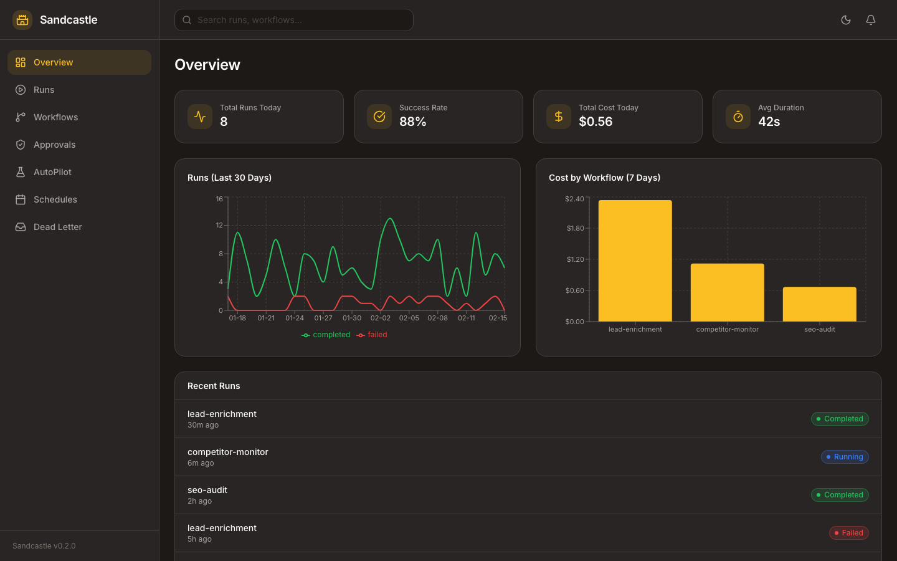
  </a>
</p>

<p align="center">
  <a href="https://gizmax.github.io/Sandcastle/"><strong>Try the Live Demo (no backend needed)</strong></a>
</p>

---

## Table of Contents

- [Why Sandcastle?](#why-sandcastle)
- [Start Local. Scale When Ready.](#start-local-scale-when-ready)
- [Quickstart](#quickstart)
- [MCP Integration](#mcp-integration)
- [Features](#features)
- [Pluggable Sandbox Backends](#pluggable-sandbox-backends)
- [Multi-Provider Model Routing](#multi-provider-model-routing)
- [Workflow Engine](#workflow-engine)
- [Human Approval Gates](#human-approval-gates)
- [Self-Optimizing Workflows (AutoPilot)](#self-optimizing-workflows-autopilot)
- [Hierarchical Workflows (Workflow-as-Step)](#hierarchical-workflows-workflow-as-step)
- [Policy Engine](#policy-engine)
- [Cost-Latency Optimizer](#cost-latency-optimizer)
- [Directory Input & CSV Export](#directory-input--csv-export)
- [23 Built-in Workflow Templates](#23-built-in-workflow-templates)
- [Real-time Event Stream](#real-time-event-stream)
- [Run Time Machine](#run-time-machine)
- [Budget Guardrails](#budget-guardrails)
- [Dashboard](#dashboard)
- [API Reference](#api-reference)
- [Multi-Tenant Auth](#multi-tenant-auth)
- [Webhooks](#webhooks)
- [Architecture](#architecture)
- [Configuration](#configuration)
- [Development](#development)
- [Acknowledgements](#acknowledgements)
- [License](#license)

---

## Why Sandcastle?

AI agent frameworks give you building blocks - LLM calls, tool use, maybe a graph. But when you start building real products, the glue code piles up fast:

- **"Step A scrapes, step B enriches, step C scores."** - You need workflow orchestration.
- **"Fan out over 50 leads in parallel, then merge."** - You need a DAG engine.
- **"Bill the customer per enrichment, track costs per run."** - You need usage metering.
- **"Alert me if the agent fails, retry with backoff."** - You need production error handling.
- **"Run this every 6 hours and POST results to Slack."** - You need scheduling and webhooks.
- **"A human should review this before the agent continues."** - You need approval gates.
- **"Block the output if it contains PII or leaked secrets."** - You need policy enforcement.
- **"Pick the cheapest model that still meets quality SLOs."** - You need cost-latency optimization.
- **"Use Claude for quality, GPT for speed, Gemini for cost."** - You need multi-provider routing.
- **"Run on E2B cloud, Docker locally, or Cloudflare at the edge."** - You need pluggable runtimes.
- **"Show me what's running, what failed, and what it cost."** - You need a dashboard.

Sandcastle handles all of that. Define workflows in YAML, pick your sandbox backend, choose your models, and ship to production.

---

## Start Local. Scale When Ready.

No Docker, no database server, no Redis. Install, run, done.

```bash
pip install sandcastle-ai
sandcastle init        # asks for API keys, picks sandbox backend, writes .env
sandcastle serve       # starts API + dashboard on one port
```

You'll need API keys for your chosen setup:
- **ANTHROPIC_API_KEY** - get one at [console.anthropic.com](https://console.anthropic.com/) (for Claude models)
- **E2B_API_KEY** - get one at [e2b.dev](https://e2b.dev/) (for E2B cloud sandboxes - free tier available)

Or use the `docker` backend (needs Docker installed) or `local` backend (dev only, no sandbox isolation) and skip the E2B key.

Dashboard at `http://localhost:8080`, API at `http://localhost:8080/api`, 23 workflow templates included.

Sandcastle auto-detects your environment. No `DATABASE_URL`? It uses SQLite. No `REDIS_URL`? Jobs run in-process. No S3 credentials? Files go to disk. **Same code, same API, same dashboard** - you just add connection strings when you're ready to scale.

```
 Prototype                 Staging                   Production
 ---------                 -------                   ----------
 SQLite                    PostgreSQL                PostgreSQL
 In-process queue    -->   Redis + arq          -->  Redis + arq
 Local filesystem         Local filesystem          S3 / MinIO
 Single process           Single process            API + Worker + Scheduler
```

| | Local Mode | Production Mode |
|---|---|---|
| **Database** | SQLite (auto-created in `./data/`) | PostgreSQL 16 |
| **Job Queue** | In-process (`asyncio.create_task`) | Redis 7 + arq workers |
| **Storage** | Filesystem (`./data/`) | S3 / MinIO |
| **Scheduler** | In-memory APScheduler | In-memory APScheduler |
| **Setup time** | 30 seconds | 5 minutes |
| **Config needed** | Just API keys | API keys + connection strings |
| **Best for** | Prototyping, solo devs, demos | Teams, production, multi-tenant |

### Ready to scale?

When local mode isn't enough anymore, upgrade one piece at a time. Each step is independent - do only what you need.

**Step 1 - PostgreSQL** (concurrent users, data durability)

```bash
# Install and start PostgreSQL (macOS example)
brew install postgresql@16
brew services start postgresql@16

# Create a database
createdb sandcastle

# Add to .env
echo 'DATABASE_URL=postgresql+asyncpg://localhost/sandcastle' >> .env

# Run migrations
pip install sandcastle-ai  # if not installed yet
alembic upgrade head

# Restart
sandcastle serve
```

Your SQLite data stays in `./data/`. Sandcastle starts fresh with PostgreSQL - existing local runs are not migrated.

**Step 2 - Redis** (background workers, parallel runs)

```bash
# Install and start Redis (macOS example)
brew install redis
brew services start redis

# Add to .env
echo 'REDIS_URL=redis://localhost:6379' >> .env

# Restart API + start a worker in a second terminal
sandcastle serve
sandcastle worker
```

With Redis, workflows run in background workers instead of in-process. You can run multiple workers for parallel execution.

**Step 3 - S3 / MinIO** (artifact storage)

```bash
# Add to .env
echo 'STORAGE_BACKEND=s3' >> .env
echo 'S3_BUCKET=sandcastle-artifacts' >> .env
echo 'AWS_ACCESS_KEY_ID=...' >> .env
echo 'AWS_SECRET_ACCESS_KEY=...' >> .env
# For MinIO, also set: S3_ENDPOINT_URL=http://localhost:9000

# Restart
sandcastle serve
```

**Or skip all that and use Docker:**

```bash
docker compose up -d   # PostgreSQL + Redis + API + Worker, all configured
```

---

## Quickstart

### Production Mode - Docker (recommended)

One command. PostgreSQL, Redis, API server, and background worker - all configured.

```bash
git clone https://github.com/gizmax/Sandcastle.git
cd Sandcastle

# Add your API keys
cat > .env << 'EOF'
ANTHROPIC_API_KEY=sk-ant-...
E2B_API_KEY=e2b_...
SANDBOX_BACKEND=e2b
WEBHOOK_SECRET=your-signing-secret
EOF

docker compose up -d
```

That's it. Sandcastle is running at `http://localhost:8080` with PostgreSQL 16, Redis 7, auto-migrations, and an arq background worker.

```bash
docker compose ps       # check status
docker compose logs -f  # tail logs
docker compose down     # stop everything
```

### Production Mode - Manual

If you prefer running without Docker:

```bash
git clone https://github.com/gizmax/Sandcastle.git
cd Sandcastle

cp .env.example .env   # configure all connection strings

uv sync

# Start infrastructure (your own PostgreSQL + Redis)
# Set DATABASE_URL and REDIS_URL in .env

# Run database migrations
uv run alembic upgrade head

# Start the API server (serves API + dashboard on one port)
uv run python -m sandcastle serve

# Start the async worker (separate terminal)
uv run python -m sandcastle worker
```

### Your First Workflow

```bash
# Run a workflow asynchronously
curl -X POST http://localhost:8080/api/workflows/run \
  -H "Content-Type: application/json" \
  -d '{
    "workflow": "lead-enrichment",
    "input": {
      "target_url": "https://example.com",
      "max_depth": 3
    },
    "callback_url": "https://your-app.com/api/done"
  }'

# Response: { "data": { "run_id": "a1b2c3d4-...", "status": "queued" } }
```

Or run synchronously and wait for the result:

```bash
curl -X POST http://localhost:8080/api/workflows/run/sync \
  -H "Content-Type: application/json" \
  -d '{
    "workflow": "lead-enrichment",
    "input": { "target_url": "https://example.com" }
  }'
```

### Python SDK

Install from PyPI and use Sandcastle programmatically from any Python app:

```bash
pip install sandcastle-ai
```

```python
from sandcastle import SandcastleClient

client = SandcastleClient(base_url="http://localhost:8080", api_key="sc_...")

# Run a workflow and wait for completion
run = client.run("lead-enrichment",
    input={"target_url": "https://example.com"},
    wait=True,
)
print(run.status)          # "completed"
print(run.total_cost_usd)  # 0.12
print(run.outputs)         # {"lead_score": 87, "tier": "A", ...}

# List recent runs
for r in client.list_runs(status="completed", limit=5).items:
    print(f"{r.workflow_name}: {r.status}")

# Stream live events from a running workflow
for event in client.stream(run.run_id):
    print(event)

# Replay a failed step with a different model
new_run = client.fork(run.run_id, from_step="score", changes={"model": "opus"})
```

Async variant available for asyncio apps:

```python
from sandcastle import AsyncSandcastleClient

async with AsyncSandcastleClient() as client:
    run = await client.run("lead-enrichment", input={...}, wait=True)
```

### CLI

The `sandcastle` command gives you full control from the terminal:

```bash
# Interactive setup wizard (API keys, .env, workflows/)
sandcastle init

# Start the server (API + dashboard on one port)
sandcastle serve

# Run a workflow
sandcastle run lead-enrichment -i target_url=https://example.com

# Run and wait for result
sandcastle run lead-enrichment -i target_url=https://example.com --wait

# Check run status
sandcastle status <run-id>

# Stream live logs
sandcastle logs <run-id> --follow

# List runs, workflows, schedules
sandcastle ls runs --status completed --limit 10
sandcastle ls workflows
sandcastle ls schedules

# Manage schedules
sandcastle schedule create lead-enrichment "0 9 * * *" -i target_url=https://example.com
sandcastle schedule delete <schedule-id>

# Cancel a running workflow
sandcastle cancel <run-id>

# Health check
sandcastle health
```

Connection defaults to `http://localhost:8080`. Override with `--url` or `SANDCASTLE_URL` env var. Auth via `--api-key` or `SANDCASTLE_API_KEY`.

### MCP Integration

Sandcastle ships with a built-in [MCP (Model Context Protocol)](https://modelcontextprotocol.io/) server. This lets Claude Desktop, Cursor, Windsurf, and any MCP-compatible client interact with Sandcastle directly from the chat interface - run workflows, check status, manage schedules, browse results.

```
Claude Desktop  --stdio-->  sandcastle mcp  --HTTP-->  localhost:8080
     (client)               (MCP server)              (sandcastle serve)
```

Install the MCP extra:

```bash
pip install sandcastle-ai[mcp]
```

#### Available MCP Tools

| Tool | Description |
|------|-------------|
| `run_workflow` | Run a saved workflow by name with optional input data and wait mode |
| `run_workflow_yaml` | Run a workflow from inline YAML definition |
| `get_run_status` | Get detailed run status including all step results |
| `cancel_run` | Cancel a queued or running workflow |
| `list_runs` | List runs with optional status and workflow filters |
| `save_workflow` | Save a workflow YAML definition to the server |
| `create_schedule` | Create a cron schedule for a workflow |
| `delete_schedule` | Delete a workflow schedule |

#### Available MCP Resources

| URI | Description |
|-----|-------------|
| `sandcastle://workflows` | Read-only list of all available workflows |
| `sandcastle://schedules` | Read-only list of all active schedules |
| `sandcastle://health` | Server health status (sandbox backend, DB, Redis) |

#### Client Configuration

**Claude Desktop** - add to `~/Library/Application Support/Claude/claude_desktop_config.json`:

```json
{
  "mcpServers": {
    "sandcastle": {
      "command": "sandcastle",
      "args": ["mcp"],
      "env": {
        "SANDCASTLE_URL": "http://localhost:8080",
        "SANDCASTLE_API_KEY": "sc_..."
      }
    }
  }
}
```

**Cursor** - add to `.cursor/mcp.json` in your project root:

```json
{
  "mcpServers": {
    "sandcastle": {
      "command": "sandcastle",
      "args": ["mcp", "--url", "http://localhost:8080"]
    }
  }
}
```

**Windsurf** - add to `~/.codeium/windsurf/mcp_config.json`:

```json
{
  "mcpServers": {
    "sandcastle": {
      "command": "sandcastle",
      "args": ["mcp"]
    }
  }
}
```

The MCP server uses stdio transport (spawned as a child process by the client). It requires a running `sandcastle serve` instance to connect to. Connection is configured via `--url` / `--api-key` CLI args or `SANDCASTLE_URL` / `SANDCASTLE_API_KEY` env vars.

#### What You Can Do from Chat

Once connected, ask your AI assistant to:

- "Run the lead-enrichment workflow for https://example.com"
- "What's the status of my last run?"
- "List all failed runs from today"
- "Create a schedule to run data-sync every day at 9am"
- "Cancel run abc-123"
- "Save this workflow YAML to the server"
- "Show me all available workflows"
- "Check if Sandcastle is healthy"

---

## Features

| Capability | |
|---|---|
| **Pluggable sandbox backends** (E2B, Docker, Local, Cloudflare) | Yes |
| **Multi-provider model routing** (Claude, OpenAI, MiniMax, Google/Gemini) | Yes |
| **Zero-config local mode** | Yes |
| **DAG workflow orchestration** | Yes |
| **Parallel step execution** | Yes |
| **Run Time Machine (replay/fork)** | Yes |
| **Budget guardrails** | Yes |
| **Run cancellation** | Yes |
| **Idempotent run requests** | Yes |
| **Persistent storage (S3/MinIO)** | Yes |
| **Webhook callbacks (HMAC-signed)** | Yes |
| **Scheduled / cron agents** | Yes |
| **Retry logic with exponential backoff** | Yes |
| **Dead letter queue with full replay** | Yes |
| **Per-run cost tracking** | Yes |
| **SSE live streaming** | Yes |
| **Multi-tenant API keys** | Yes |
| **Python SDK + async client** | Yes |
| **CLI tool** | Yes |
| **MCP server** (Claude Desktop, Cursor, Windsurf) | Yes |
| **Docker one-command deploy** | Yes |
| **Dashboard with real-time monitoring** | Yes |
| **23 built-in workflow templates** | Yes |
| **Visual workflow builder** | Yes |
| **Directory input (file processing)** | Yes |
| **CSV export per step** | Yes |
| **Human approval gates** | Yes |
| **Self-optimizing workflows (AutoPilot)** | Yes |
| **Hierarchical workflows (workflow-as-step)** | Yes |
| **Policy engine (PII redaction, secret guard)** | Yes |
| **Cost-latency optimizer (SLO-based routing)** | Yes |
| **Concurrency control** (rate limiter, semaphores) | Yes |

---

## Pluggable Sandbox Backends

Sandcastle uses the **Sandshore runtime** with pluggable backends for agent execution. Each step runs inside an isolated sandbox - choose the backend that fits your needs:

| Backend | Description | Best For |
|---------|-------------|----------|
| **e2b** (default) | Cloud sandboxes via [E2B](https://e2b.dev/) SDK | Production, zero-infra setup |
| **docker** | Local Docker containers via aiodocker | Self-hosted, air-gapped environments |
| **local** | Direct subprocess on the host (no isolation) | Development and testing only |
| **cloudflare** | Edge sandboxes via Cloudflare Workers | Low-latency, globally distributed |

```bash
# Set in .env or via sandcastle init
SANDBOX_BACKEND=e2b        # default
SANDBOX_BACKEND=docker     # requires Docker + pip install sandcastle-ai[docker]
SANDBOX_BACKEND=local      # dev only, no isolation
SANDBOX_BACKEND=cloudflare # requires deployed CF Worker
```

All backends share the same `SandboxBackend` protocol - same YAML, same API, same dashboard. Switch backends without changing workflows.

---

## Multi-Provider Model Routing

Use different AI providers per step. Claude for quality-critical tasks, cheaper models for simple scoring, or mix providers in a single workflow:

| Model ID | Provider | Runner | Pricing (per 1M tokens) |
|----------|----------|--------|-------------------------|
| `sonnet` | Claude (Anthropic) | Claude Agent SDK | $3 in / $15 out |
| `opus` | Claude (Anthropic) | Claude Agent SDK | $15 in / $75 out |
| `haiku` | Claude (Anthropic) | Claude Agent SDK | $0.80 in / $4 out |
| `openai/codex-mini` | OpenAI | OpenAI-compatible | $0.25 in / $2 out |
| `openai/codex` | OpenAI | OpenAI-compatible | $1.25 in / $10 out |
| `minimax/m2.5` | MiniMax | OpenAI-compatible | $0.30 in / $1.20 out |
| `google/gemini-2.5-pro` | Google (via OpenRouter) | OpenAI-compatible | $4 in / $20 out |

```yaml
steps:
  - id: "research"
    model: opus                    # Claude for deep research
    prompt: "Research {input.company} thoroughly."

  - id: "score"
    depends_on: ["research"]
    model: haiku                   # Claude Haiku for cheap scoring
    prompt: "Score this lead 1-100."

  - id: "classify"
    depends_on: ["research"]
    model: openai/codex-mini       # OpenAI for classification
    prompt: "Classify the industry."
```

Set the API keys in `.env` for each provider you want to use:

```bash
ANTHROPIC_API_KEY=sk-ant-...       # Claude models
OPENAI_API_KEY=sk-...              # OpenAI models
MINIMAX_API_KEY=...                # MiniMax models
OPENROUTER_API_KEY=sk-or-...       # Google Gemini via OpenRouter
```

---

## Workflow Engine

Define multi-step agent pipelines as YAML. Each step can run in parallel, depend on previous steps, pass data forward, and use different models.

### Example: lead-enrichment.yaml

```yaml
name: "Lead Enrichment"
description: "Scrape, enrich, and score leads for sales outreach."
default_model: sonnet
default_max_turns: 10
default_timeout: 300

steps:
  - id: "scrape"
    prompt: |
      Visit {input.target_url} and extract:
      company name, employee count, main product, contact info.
      Return as structured JSON.
    output_schema:
      type: object
      properties:
        company_name: { type: string }
        employees: { type: integer }
        product: { type: string }
        contact_email: { type: string }

  - id: "enrich"
    depends_on: ["scrape"]
    prompt: |
      Given this company data: {steps.scrape.output}
      Research: revenue, industry, key decision makers, recent news.
    retry:
      max_attempts: 3
      backoff: exponential
      on_failure: abort

  - id: "score"
    depends_on: ["enrich"]
    prompt: |
      Score this lead 1-100 for B2B SaaS potential.
      Based on: {steps.enrich.output}
    model: haiku

on_complete:
  storage_path: "leads/{run_id}/result.json"
```

### Parallel Execution

Steps at the same DAG layer run concurrently. Use `parallel_over` to fan out over a list:

```yaml
steps:
  - id: "fetch-competitors"
    prompt: "Identify top 3 competitors for {input.company_url}."

  - id: "analyze"
    depends_on: ["fetch-competitors"]
    parallel_over: "steps.fetch-competitors.output.competitors"
    prompt: "Analyze {input._item} for pricing and feature changes."
    retry:
      max_attempts: 2
      backoff: exponential
      on_failure: skip

  - id: "summarize"
    depends_on: ["analyze"]
    prompt: "Create executive summary from: {steps.analyze.output}"
```

### Data Passing Between Steps

When you connect steps with `depends_on`, data flows automatically. You don't need to reference the previous step's output explicitly - Sandcastle injects it as context:

```yaml
steps:
  - id: "research"
    prompt: "Find all EU presidents and return as JSON."

  - id: "enrich"
    depends_on: ["research"]
    prompt: "Add political party and key decisions for each president."
    # Output from "research" is automatically available - no need for {steps.research.output}
```

For fine-grained control, you can still reference specific outputs explicitly using `{steps.STEP_ID.output}` or drill into fields with `{steps.STEP_ID.output.field_name}`:

```yaml
  - id: "score"
    depends_on: ["scrape", "enrich"]
    prompt: |
      Score this lead based on company: {steps.scrape.output.company_name}
      and enrichment: {steps.enrich.output}
```

**Rules:**
- `depends_on` controls execution order **and** data flow
- Unreferenced dependency outputs are appended as context automatically
- Explicitly referenced outputs (`{steps.X.output}`) are placed exactly where you write them
- `{input.X}` references workflow input parameters passed at run time

---

## Human Approval Gates

Pause any workflow at a critical step and wait for human review before continuing. Define approval steps in YAML, set timeouts with auto-actions (skip or abort), and approve/reject/skip via API or dashboard. Reviewers can edit the request data before approving. Webhook notifications fire when approval is needed.

```yaml
steps:
  - id: "generate-report"
    prompt: "Generate quarterly report..."

  - id: "review"
    type: approval
    depends_on: ["generate-report"]
    approval_config:
      message: "Review the generated report before sending to client"
      timeout_hours: 24
      on_timeout: abort
      allow_edit: true

  - id: "send"
    depends_on: ["review"]
    prompt: "Send the approved report to {input.client_email}"
```

---

## Self-Optimizing Workflows (AutoPilot)

A/B test different models, prompts, and configurations for any step. Sandcastle automatically runs variants, evaluates quality (via LLM judge or schema completeness), tracks cost and latency, and picks the best-performing variant. Supports quality, cost, latency, and pareto optimization targets.

```yaml
steps:
  - id: "enrich"
    prompt: "Enrich this lead: {input.company}"
    autopilot:
      enabled: true
      optimize_for: quality
      min_samples: 20
      auto_deploy: true
      variants:
        - id: fast
          model: haiku
        - id: quality
          model: opus
          prompt: "Thoroughly research and enrich: {input.company}"
      evaluation:
        method: llm_judge
        criteria: "Rate completeness, accuracy, and depth 1-10"
```

---

## Hierarchical Workflows (Workflow-as-Step)

Call one workflow from another. Parent workflows can pass data to children via input mapping, collect results via output mapping, and fan out over lists with configurable concurrency. Depth limiting prevents runaway recursion.

```yaml
steps:
  - id: "find-leads"
    prompt: "Find 10 leads in {input.industry}"

  - id: "enrich-each"
    type: sub_workflow
    depends_on: ["find-leads"]
    sub_workflow:
      workflow: lead-enrichment
      input_mapping:
        company: steps.find-leads.output.company
      output_mapping:
        result: enriched_data
      max_concurrent: 5
      timeout: 600

  - id: "summarize"
    depends_on: ["enrich-each"]
    prompt: "Summarize enrichment results: {steps.enrich-each.output}"
```

---

## Policy Engine

Declarative rules evaluated against every step output. Detect PII, block secrets, inject dynamic approval gates, or alert on suspicious patterns - all defined in YAML. Policies can be global (apply to all steps) or scoped per step.

```yaml
policies:
  - id: pii-redact
    description: "Redact personal data from outputs"
    severity: high
    trigger:
      type: pattern
      patterns:
        - type: builtin
          name: email
        - type: builtin
          name: phone
        - type: builtin
          name: ssn
    action:
      type: redact

  - id: cost-guard
    description: "Block steps that are too expensive"
    severity: critical
    trigger:
      type: condition
      expression: "step_cost > 2.0"
    action:
      type: block
      message: "Step exceeded $2 cost limit"

steps:
  - id: "research"
    prompt: "Research {input.company}"
    policies: ["pii-redact", "cost-guard"]

  - id: "internal-only"
    prompt: "Prepare internal report..."
    policies: []  # skip all policies for this step
```

Built-in patterns for email, phone, SSN, and credit card numbers. Custom regex patterns supported. Condition triggers use safe expression evaluation - no arbitrary code execution.

---

## Cost-Latency Optimizer

SLO-based dynamic model routing. Define quality, cost, and latency constraints per step, and Sandcastle automatically selects the best model from a pool based on historical performance data. Budget pressure detection forces cheaper models when spending approaches limits.

```yaml
steps:
  - id: "enrich"
    prompt: "Enrich data for {input.company}"
    slo:
      quality_min: 0.7
      cost_max_usd: 0.15
      latency_max_seconds: 60
      optimize_for: cost
    model_pool:
      - id: fast-cheap
        model: haiku
        max_turns: 5
      - id: balanced
        model: sonnet
        max_turns: 10
      - id: thorough
        model: opus
        max_turns: 20

  - id: "classify"
    prompt: "Classify the enriched data"
    slo:
      quality_min: 0.8
      optimize_for: quality
    # No model_pool - auto-generates haiku/sonnet/opus pool
```

The optimizer scores each model option across multiple objectives, filters out options that violate SLO constraints, and tracks confidence based on sample count. Cold starts default to a balanced middle option until enough data is collected.

---

## Directory Input & CSV Export

Process files from a directory and export results to CSV - all configured in YAML. The workflow builder includes a directory browser and CSV export toggle per step.

### Directory input

Mark a step as directory-aware and Sandcastle adds a `directory` field to the workflow's input schema. Users provide a path at run time, and the agent reads files from that directory.

```yaml
input_schema:
  required: ["directory"]
  properties:
    directory:
      type: string
      description: "Path to directory"
      default: "~/Documents"

steps:
  - id: "analyze"
    prompt: |
      Read every file in {input.directory} and summarize the key findings.
```

### CSV export

Any step can export its output to CSV. Two modes:

- **new_file** - each run creates a timestamped file (e.g. `report_20260217_143022.csv`)
- **append** - all runs append rows to a single file, perfect for ongoing data collection

```yaml
steps:
  - id: "extract"
    prompt: "Extract all contacts from {input.directory}."
    csv_output:
      directory: ./output
      mode: new_file
      filename: contacts    # optional, defaults to step ID

  - id: "score"
    depends_on: ["extract"]
    prompt: "Score each contact for sales potential."
    csv_output:
      directory: ./output
      mode: append          # all runs land in one file
      filename: scores
```

Works with any output shape - dicts become columns, lists of dicts become rows, plain text goes into a `value` column. Directories are created automatically.

---

## 23 Built-in Workflow Templates

<p align="center">
  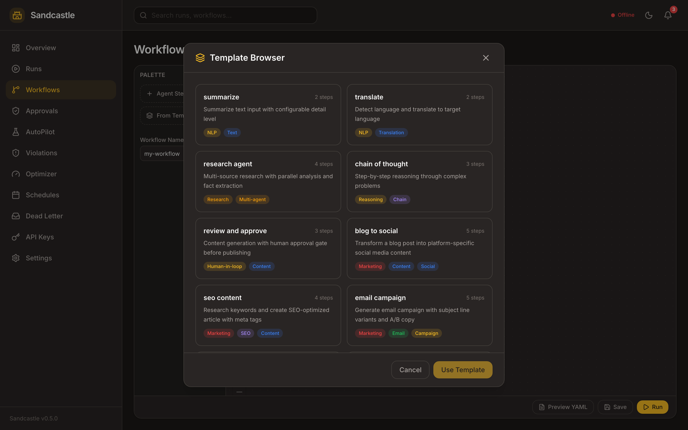
</p>

Sandcastle ships with production-ready workflow templates across 6 categories:

| Category | Templates |
|----------|-----------|
| **Marketing** | Blog to Social, SEO Content, Email Campaign, Competitor Analysis, Ad Copy Generator, Competitive Radar, Content Atomizer |
| **Sales** | Lead Enrichment, Proposal Generator, Meeting Recap, Lead Outreach |
| **Support** | Ticket Classifier, Review Sentiment |
| **HR** | Job Description, Resume Screener |
| **Legal** | Contract Review |
| **Product** | Release Notes, Data Extractor |

Plus 5 foundational templates: Summarize, Translate, Research Agent, Chain of Thought, Review and Approve.

```bash
# List all available templates
sandcastle templates

# Use a template
curl http://localhost:8080/api/templates
```

Each template includes parallel execution stages, structured output schemas, and human approval gates where appropriate. Use them directly or as starting points in the Workflow Builder.

---

## Real-time Event Stream

Sandcastle provides a global SSE endpoint for real-time updates across the entire system:

```bash
# Connect to the global event stream
curl -N http://localhost:8080/api/events
```

The dashboard uses this stream to power live indicators showing connection status, toast notifications for run completion and failure, and instant updates across all pages. Event types include:

- `run.started` - A workflow run was queued and started executing
- `run.completed` - A run finished successfully with outputs
- `run.failed` - A run failed (all retries exhausted)
- `step.started`, `step.completed`, `step.failed` - Per-step progress events
- `dlq.new` - A new item landed in the dead letter queue

No polling, no delays - every state change is pushed the moment it happens.

---

## Run Time Machine

Every completed step saves a checkpoint. When something goes wrong - or you just want to try a different approach - you don't have to start over.

**Replay** - Re-run from any step. Sandcastle loads the checkpoint from just before that step and continues execution. All prior steps are skipped, their outputs restored from the checkpoint. Costs only what's re-executed.

**Fork** - Same as replay, but you change something first. Swap the model from Haiku to Opus. Rewrite the prompt. Adjust max_turns. The new run branches off with your changes and Sandcastle tracks the full lineage.

```bash
# Replay from the "enrich" step
curl -X POST http://localhost:8080/api/runs/{run_id}/replay \
  -H "Content-Type: application/json" \
  -d '{ "from_step": "enrich" }'

# Fork with a different model
curl -X POST http://localhost:8080/api/runs/{run_id}/fork \
  -H "Content-Type: application/json" \
  -d '{
    "from_step": "score",
    "changes": { "model": "opus", "prompt": "Score more conservatively..." }
  }'
```

---

## Budget Guardrails

Set a spending limit per run, per tenant, or as a global default. Sandcastle checks the budget after every step:

- **80%** - Warning logged, execution continues
- **100%** - Hard stop, status = `budget_exceeded`

Budget resolution order: request `max_cost_usd` > tenant API key limit > `DEFAULT_MAX_COST_USD` env var.

```bash
curl -X POST http://localhost:8080/api/workflows/run \
  -d '{ "workflow": "enrichment", "input": {...}, "max_cost_usd": 0.50 }'
```

---

## Dashboard

Sandcastle ships with a full-featured dashboard built with React, TypeScript, and Tailwind CSS. Dark and light theme, real-time updates, and zero configuration - just open `http://localhost:8080` after `sandcastle serve`. For frontend development, run `cd dashboard && npm run dev`.

### Overview

KPI cards, 30-day run trends, cost breakdown per workflow, recent runs at a glance.

<p align="center">
  
</p>

<details>
<summary>Light mode</summary>
<p align="center">
  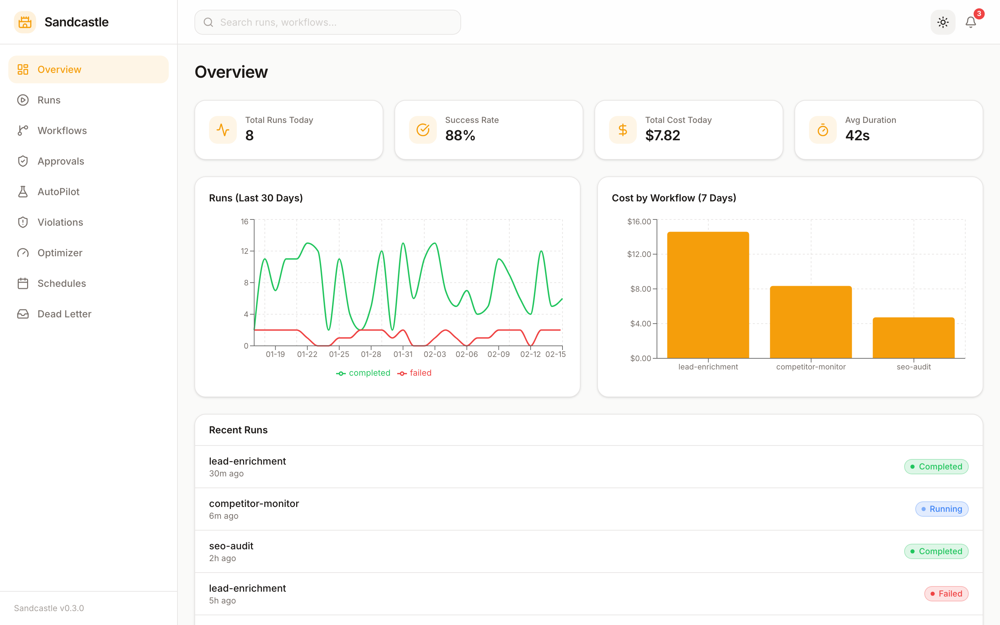
</p>
</details>

### Runs

Filterable run history with status badges, duration, cost per run. Auto-refreshes every 5 seconds for active runs.

<p align="center">
  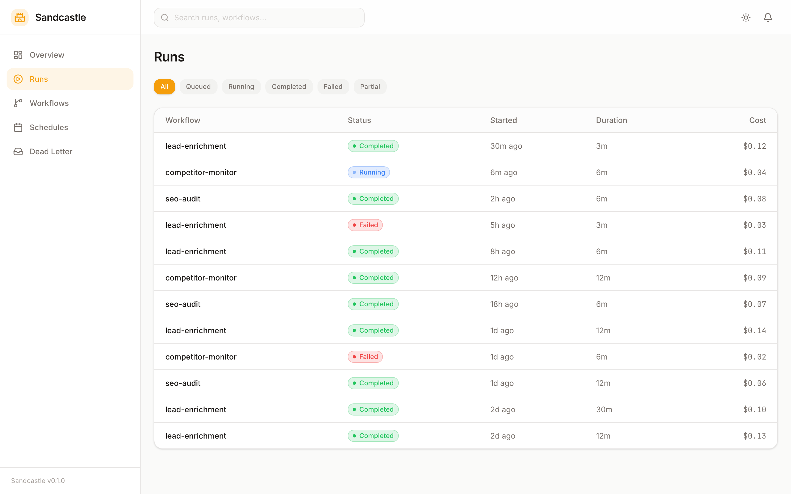
</p>

### Run Detail - Completed with Budget Bar

Step-by-step timeline with expandable outputs, per-step cost and duration. Budget bar shows how close a run got to its spending limit.

<p align="center">
  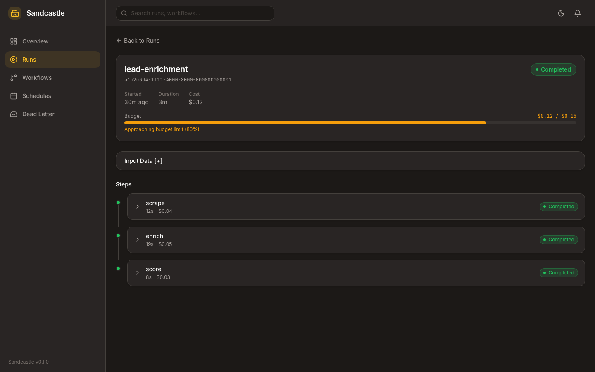
</p>

### Run Detail - Failed with Replay & Fork

When a step fails, expand it to see the full error, retry count, and two powerful recovery options: **Replay from here** re-runs from that step with the same context. **Fork from here** lets you change the prompt, model, or parameters before re-running.

<p align="center">
  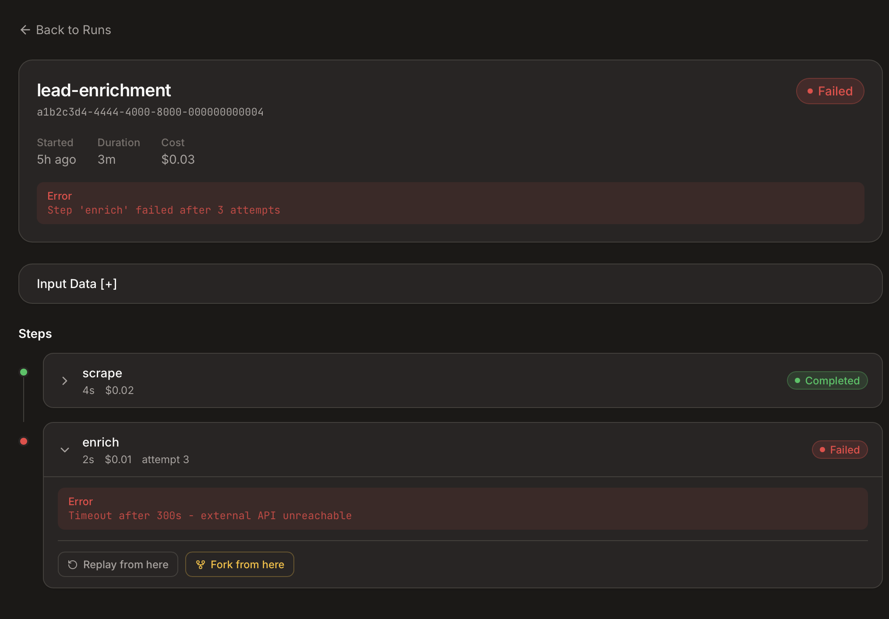
</p>

### Run Detail - Running with Parallel Steps

Live view of a running workflow showing parallel step execution. Steps with a pulsing blue dot are currently executing inside sandboxes.

<p align="center">
  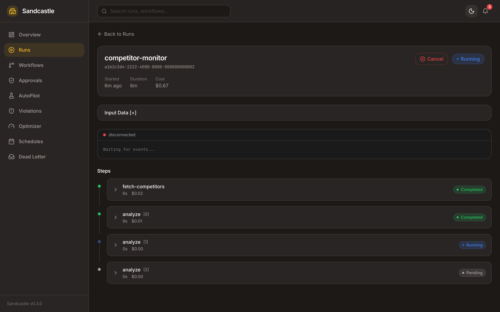
</p>

### Run Lineage

When you replay or fork a run, Sandcastle tracks the full lineage. The run detail page shows the parent-child relationship so you can trace exactly how you got here.

<p align="center">
  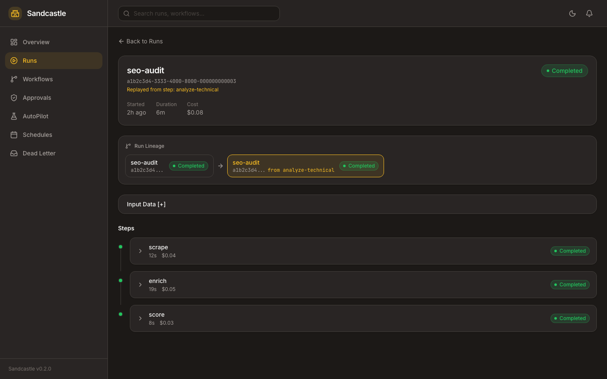
</p>

### Workflows

Grid of workflow cards with step count, descriptions, and quick-action buttons. Click "Run" to trigger a workflow with custom input and budget limits.

<p align="center">
  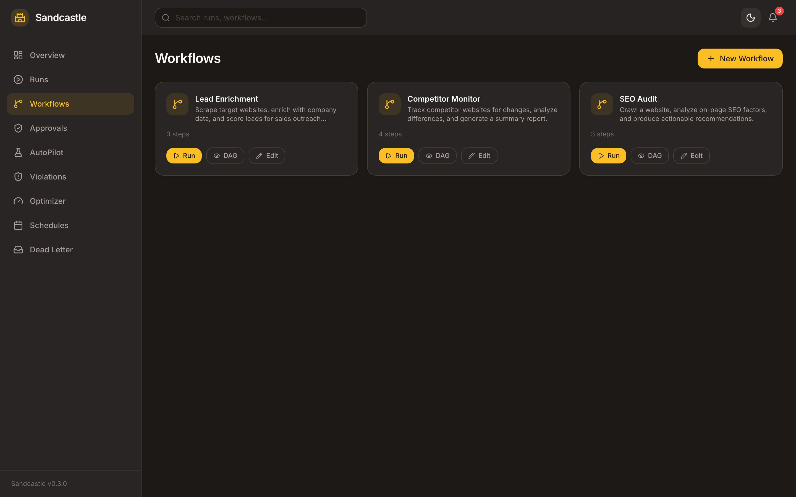
</p>

### Visual DAG Preview

Click "DAG" on any workflow card to expand an interactive graph of all steps, their dependencies, and assigned models. Powered by React Flow.

<p align="center">
  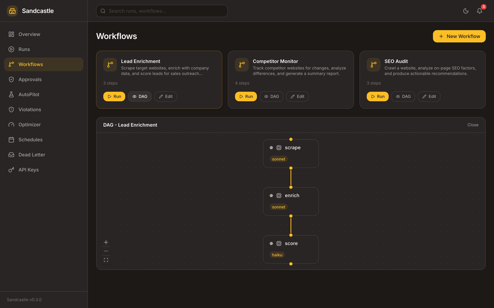
</p>

### Workflow Builder

Visual drag-and-drop editor for building workflows. Add steps, connect dependencies, configure models and timeouts, then preview the generated YAML. Collapsible advanced sections for retry logic, CSV export, AutoPilot, approval gates, policy rules, and SLO optimizer - all reflected in the YAML preview. Directory input with a server-side file browser. Editing an existing workflow loads its steps and edges into the canvas.

<p align="center">
  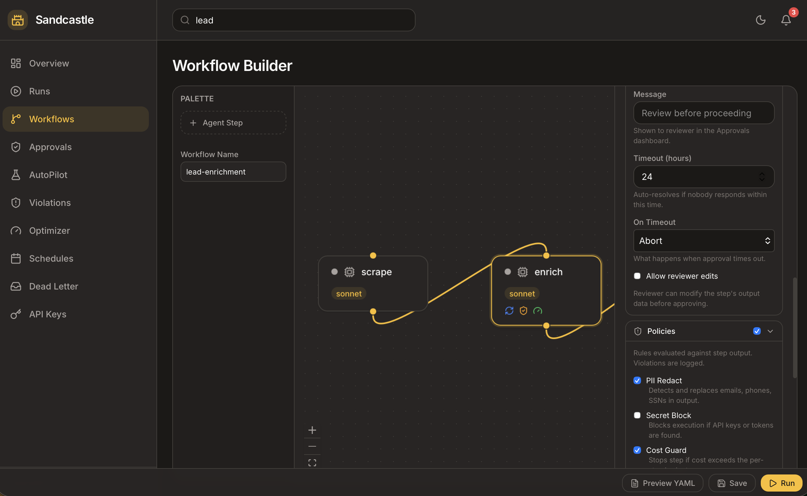
</p>

### Schedules

Cron-based scheduling with human-readable descriptions, enable/disable toggle, and inline edit. Click "Edit" to change the cron expression or toggle a schedule without leaving the page.

<p align="center">
  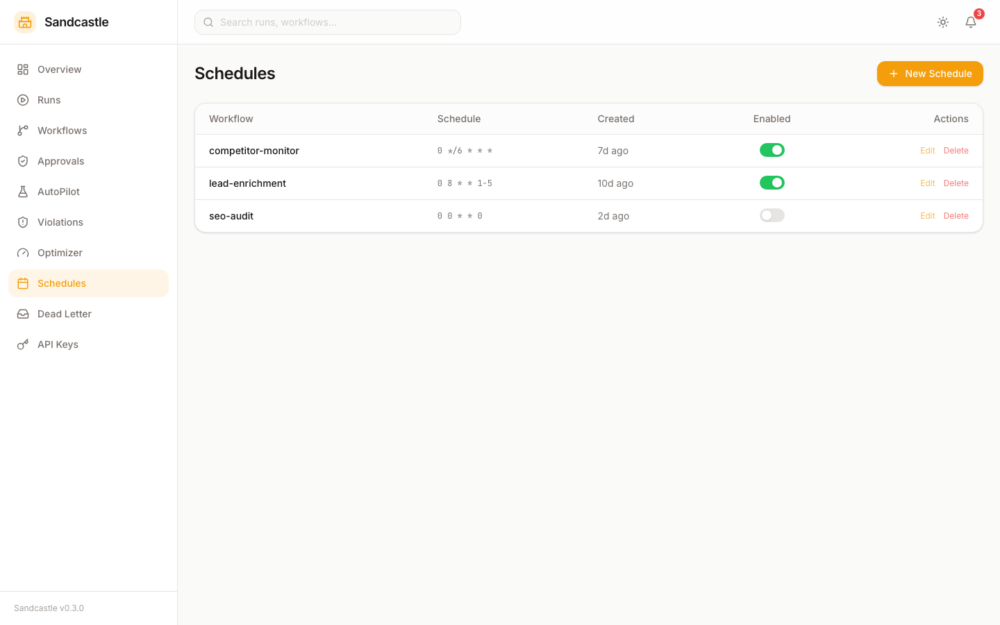
</p>

### API Keys

Create, view, and deactivate multi-tenant API keys. Key prefix shown in monospace, full key revealed only once on creation with a copy-to-clipboard flow and warning banner.

<p align="center">
  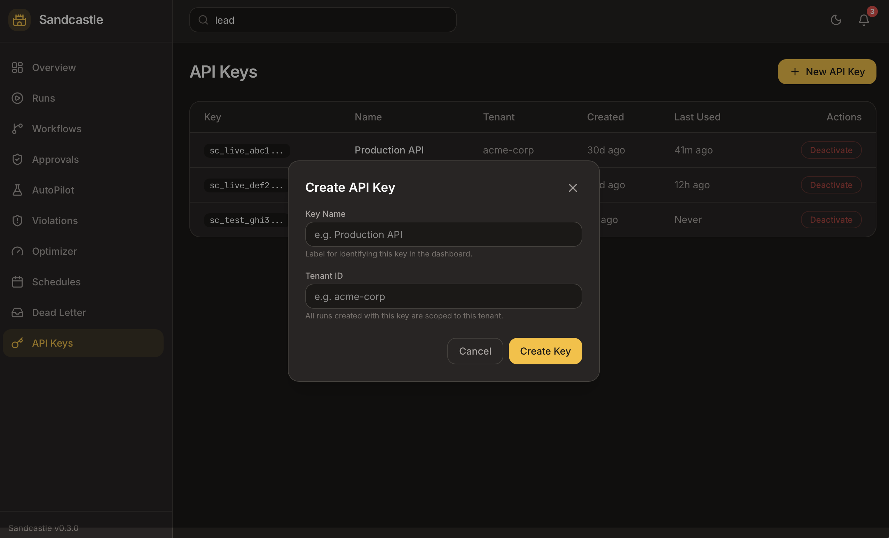
</p>

### Dead Letter Queue

Failed steps that exhausted all retries land here. Retry triggers a full re-run. Resolve marks the issue as handled. Sidebar badge shows unresolved count.

<p align="center">
  
</p>

### Approval Gates

Any workflow step can pause execution and wait for human review before continuing. The approvals page shows all pending, approved, rejected, and skipped gates with filterable tabs. Each pending approval has Approve, Reject, and Skip buttons. Configurable timeouts auto-resolve approvals if nobody responds. Webhook notifications fire when approval is needed.

<p align="center">
  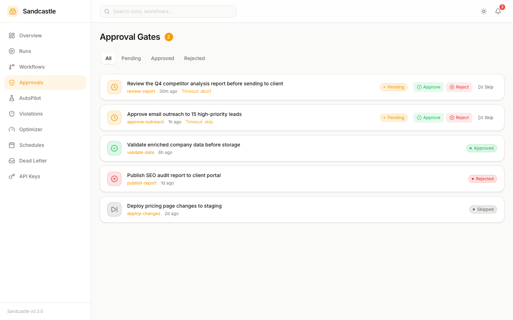
</p>

<details>
<summary>Expanded with request data</summary>

Click any approval to expand it and see the full request data the agent produced. If `allow_edit` is enabled, reviewers can modify the data before approving - giving humans final control over what the next step receives.

<p align="center">
  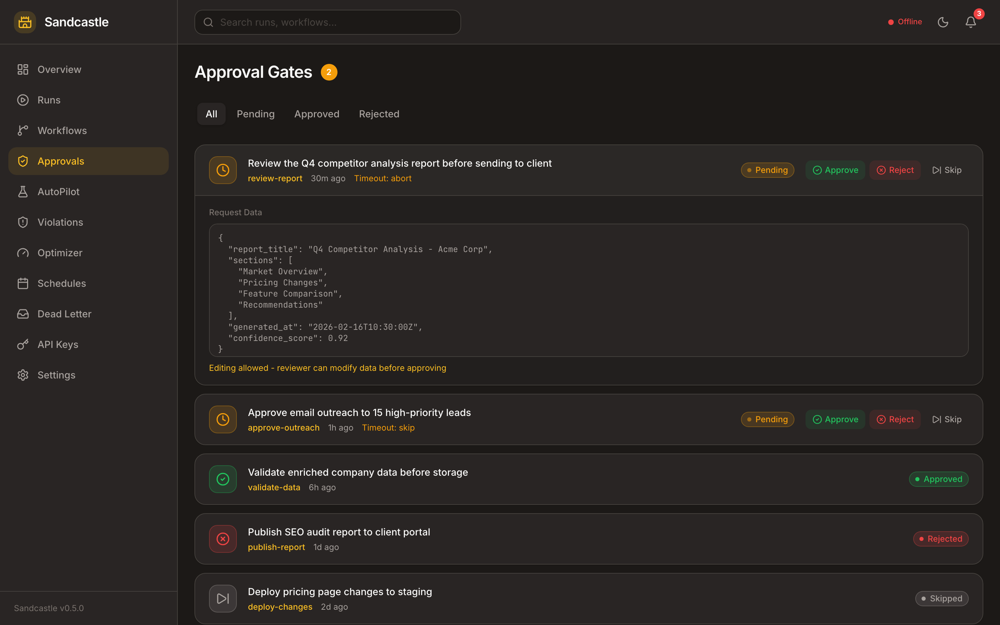
</p>
</details>

### AutoPilot - Self-Optimizing Workflows

A/B test different models, prompts, and configurations on any workflow step. Sandcastle automatically runs variants, evaluates quality (LLM judge or schema completeness), and tracks cost vs latency vs quality. Stats cards show active experiments, total samples collected, average quality improvement, and total cost savings. Once enough samples are collected, the best-performing variant is auto-deployed.

<p align="center">
  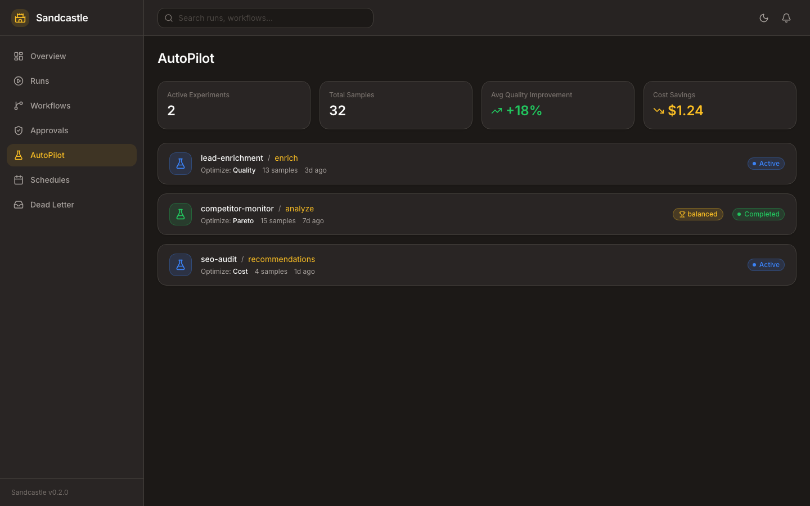
</p>

<details>
<summary>Expanded with variant comparison</summary>

Expand an experiment to see the variant comparison table. Each variant shows sample count, average quality score (color-coded), average cost, and average duration. The "BEST" badge highlights the current leader. Deploy any variant manually, or let AutoPilot pick the winner automatically based on your optimization target (quality, cost, latency, or pareto).

<p align="center">
  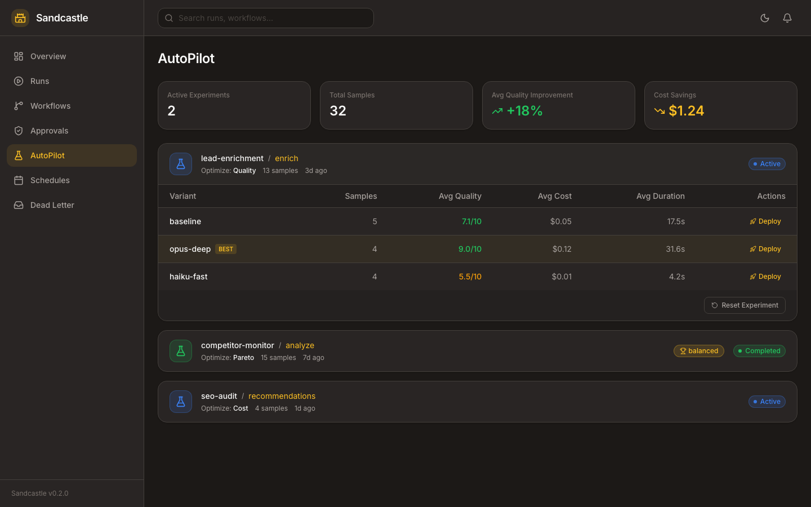
</p>
</details>

### Policy Violations

Every policy trigger is logged with severity, action taken, and full context. Stats cards show 30-day totals, critical and high counts, and the most-triggered policy. Filter by severity (Critical, High, Medium, Low). Color-coded badges show what action was taken - blocked, redacted, flagged, or logged. Green checkmark indicates the output was automatically modified.

<p align="center">
  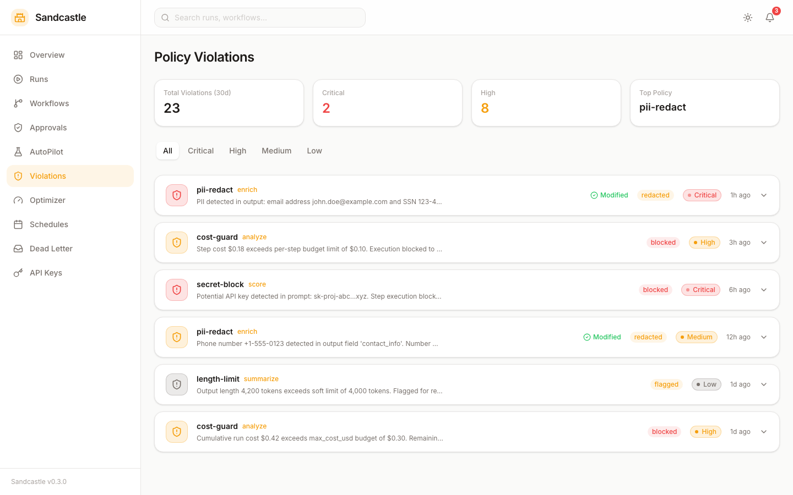
</p>

<details>
<summary>Expanded with trigger details</summary>

Click any violation to expand and see the full trigger details - what pattern matched, what was detected, and what action was taken. Includes links to the originating run and step for quick investigation.

<p align="center">
  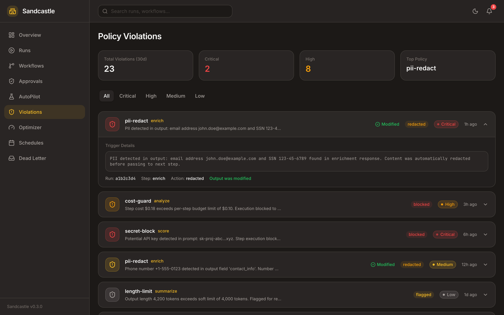
</p>
</details>

### Cost-Latency Optimizer

Real-time view of the optimizer's model routing decisions. Stats cards show total decisions, average confidence, top model with distribution percentage, and estimated savings. Each decision shows the selected model as a color-coded badge, a confidence bar, and the reasoning. Budget pressure indicators pulse red when spending approaches limits.

<p align="center">
  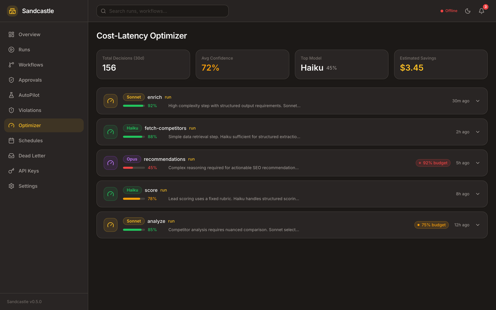
</p>

<details>
<summary>Expanded with alternatives and SLO config</summary>

Expand a decision to see the full alternatives table with scores, and the SLO configuration that drove the selection. The "SELECTED" badge highlights which model won.

<p align="center">
  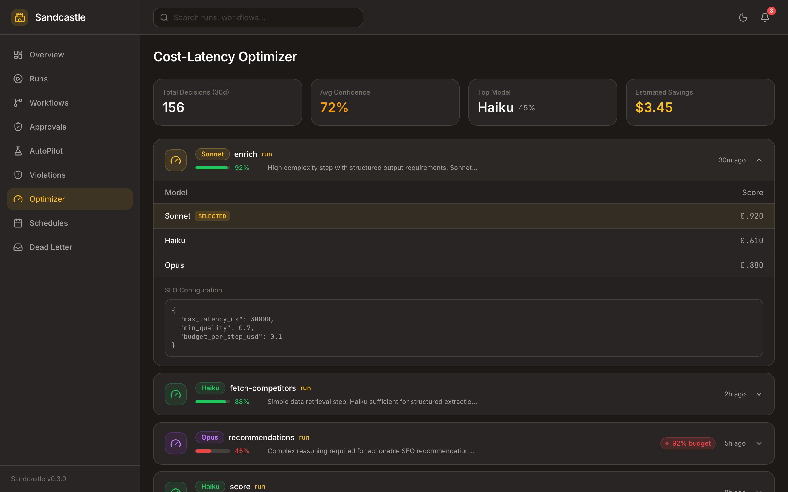
</p>
</details>

---

## API Reference

### Workflows

| Method | Endpoint | Description |
|--------|----------|-------------|
| `GET` | `/api/workflows` | List available workflows |
| `POST` | `/api/workflows` | Save new workflow YAML |
| `POST` | `/api/workflows/run` | Run workflow async (returns run_id) |
| `POST` | `/api/workflows/run/sync` | Run workflow sync (blocks until done) |

### Runs

| Method | Endpoint | Description |
|--------|----------|-------------|
| `GET` | `/api/runs` | List runs (filterable by status, workflow, date, tenant) |
| `GET` | `/api/runs/{id}` | Get run detail with step statuses |
| `GET` | `/api/runs/{id}/stream` | SSE stream of live progress |
| `POST` | `/api/runs/{id}/cancel` | Cancel a running workflow |
| `POST` | `/api/runs/{id}/replay` | Replay from a specific step |
| `POST` | `/api/runs/{id}/fork` | Fork from a step with overrides |

### Schedules

| Method | Endpoint | Description |
|--------|----------|-------------|
| `POST` | `/api/schedules` | Create cron schedule |
| `GET` | `/api/schedules` | List all schedules |
| `PATCH` | `/api/schedules/{id}` | Update schedule (cron, enabled, input) |
| `DELETE` | `/api/schedules/{id}` | Delete schedule |

### Dead Letter Queue

| Method | Endpoint | Description |
|--------|----------|-------------|
| `GET` | `/api/dead-letter` | List failed items |
| `POST` | `/api/dead-letter/{id}/retry` | Retry failed step (full replay) |
| `POST` | `/api/dead-letter/{id}/resolve` | Mark as resolved |

### Approval Gates

| Method | Endpoint | Description |
|--------|----------|-------------|
| `GET` | `/api/approvals` | List approvals (filterable by status) |
| `GET` | `/api/approvals/{id}` | Get approval detail with request data |
| `POST` | `/api/approvals/{id}/approve` | Approve (optional edit + comment) |
| `POST` | `/api/approvals/{id}/reject` | Reject and fail the run |
| `POST` | `/api/approvals/{id}/skip` | Skip step and continue workflow |

### AutoPilot

| Method | Endpoint | Description |
|--------|----------|-------------|
| `GET` | `/api/autopilot/experiments` | List experiments |
| `GET` | `/api/autopilot/experiments/{id}` | Experiment detail with samples + stats |
| `POST` | `/api/autopilot/experiments/{id}/deploy` | Manually deploy a winning variant |
| `POST` | `/api/autopilot/experiments/{id}/reset` | Reset experiment |
| `GET` | `/api/autopilot/stats` | Savings and quality overview |

### Policy Engine

| Method | Endpoint | Description |
|--------|----------|-------------|
| `GET` | `/api/violations` | List policy violations (filterable) |
| `GET` | `/api/violations/stats` | Violation stats by severity, policy, day |
| `GET` | `/api/runs/{id}/violations` | Violations for a specific run |

### Optimizer

| Method | Endpoint | Description |
|--------|----------|-------------|
| `GET` | `/api/optimizer/decisions` | List routing decisions |
| `GET` | `/api/optimizer/decisions/{run_id}` | Decisions for a specific run |
| `GET` | `/api/optimizer/stats` | Model distribution, confidence, savings |

### Templates

| Method | Endpoint | Description |
|--------|----------|-------------|
| `GET` | `/api/templates` | List all built-in workflow templates |
| `GET` | `/api/templates/{id}` | Get template detail with YAML |

### Events

| Method | Endpoint | Description |
|--------|----------|-------------|
| `GET` | `/api/events` | Global SSE stream (run, step, DLQ events) |

### API Keys

| Method | Endpoint | Description |
|--------|----------|-------------|
| `POST` | `/api/api-keys` | Create API key (returns plaintext once) |
| `GET` | `/api/api-keys` | List active keys (prefix only) |
| `DELETE` | `/api/api-keys/{id}` | Deactivate key |

### System

| Method | Endpoint | Description |
|--------|----------|-------------|
| `GET` | `/api/health` | Health check (sandbox backend, DB, Redis) |
| `GET` | `/api/runtime` | Current mode info (database, queue, storage) |
| `GET` | `/api/events` | Global SSE event stream |
| `GET` | `/api/stats` | Aggregated stats and cost trends |

All responses follow the envelope format: `{ "data": ..., "error": null }` or `{ "data": null, "error": { "code": "...", "message": "..." } }`.

---

## Multi-Tenant Auth

Sandcastle supports strict multi-tenant isolation via API keys. Every API key maps to a `tenant_id`, and all queries are automatically scoped.

```bash
# Create an API key
curl -X POST http://localhost:8080/api/api-keys \
  -d '{ "tenant_id": "acme-corp", "name": "Production" }'
# Returns: { "data": { "key": "sc_abc123...", "key_prefix": "sc_abc12" } }

# Use it
curl http://localhost:8080/api/runs -H "X-API-Key: sc_abc123..."
# Only sees runs belonging to acme-corp
```

Toggle with `AUTH_REQUIRED=true|false` (default: false for local dev). When enabled, all endpoints except `/api/health` require a valid API key.

---

## Webhooks

Sandcastle signs all webhook payloads with HMAC-SHA256:

```json
{
  "run_id": "a1b2c3d4-...",
  "status": "completed",
  "outputs": { "lead_score": 87, "tier": "A" },
  "total_cost_usd": 0.12
}
```

Header: `X-Sandcastle-Signature` for verification against your `WEBHOOK_SECRET`.

---

## Architecture

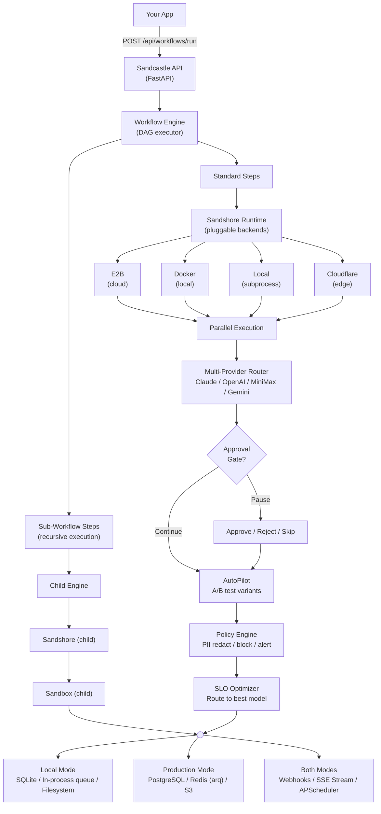
```mermaid
flowchart TD
    App["Your App"] -->|"POST /api/workflows/run"| API["Sandcastle API\n(FastAPI)"]
    API --> Engine["Workflow Engine\n(DAG executor)"]

    Engine --> Standard["Standard Steps"]
    Engine --> Sub["Sub-Workflow Steps\n(recursive execution)"]

    Standard --> Sandshore["Sandshore Runtime\n(pluggable backends)"]
    Sub --> Child["Child Engine"]
    Child --> SandshoreChild["Sandshore (child)"]

    Sandshore --> E2B["E2B\n(cloud)"]
    Sandshore --> Docker["Docker\n(local)"]
    Sandshore --> Local["Local\n(subprocess)"]
    Sandshore --> CF["Cloudflare\n(edge)"]
    SandshoreChild --> E2B2["Sandbox (child)"]

    E2B --> Execution
    Docker --> Execution
    Local --> Execution
    CF --> Execution
    E2B2 --> Merge

    Execution["Parallel Execution"] --> Provider["Multi-Provider Router\nClaude / OpenAI / MiniMax / Gemini"]

    Provider --> Gate{"Approval\nGate?"}

    Gate -->|"Pause"| Review["Approve / Reject / Skip"]
    Gate -->|"Continue"| AutoPilot

    Review --> AutoPilot["AutoPilot\nA/B test variants"]
    AutoPilot --> Policy["Policy Engine\nPII redact / block / alert"]
    Policy --> Optimizer["SLO Optimizer\nRoute to best model"]

    Optimizer --> Merge((" "))

    Merge --> LocalMode["Local Mode\nSQLite / In-process queue / Filesystem"]
    Merge --> ProdMode["Production Mode\nPostgreSQL / Redis (arq) / S3"]
    Merge --> BothModes["Both Modes\nWebhooks / SSE Stream / APScheduler"]
```

- **Local mode** - auto-created SQLite, in-process asyncio queue, and local filesystem. Zero dependencies.
- **Production mode** - PostgreSQL (runs, API keys, approvals, experiments, violations, routing decisions, checkpoints), Redis via arq (job queue, cancel flags), and S3/MinIO for persistent artifact storage.
- **Both modes** - HMAC-signed webhooks, SSE event streaming, and APScheduler for cron-based scheduling.

### Tech Stack

| Component | Local Mode | Production Mode |
|-----------|------------|-----------------|
| API Server | Python 3.12, FastAPI, Uvicorn | Python 3.12, FastAPI, Uvicorn |
| Database | SQLite + aiosqlite | PostgreSQL 16 + asyncpg + Alembic |
| Job Queue | In-process (asyncio) | Redis 7 + arq |
| Scheduler | APScheduler (in-memory) | APScheduler (in-memory) |
| Storage | Local filesystem | S3 / MinIO |
| Agent Runtime | Sandshore (E2B / Docker / Local / Cloudflare) | Sandshore (E2B / Docker / Local / Cloudflare) |
| Model Providers | Claude, OpenAI, MiniMax, Google/Gemini | Claude, OpenAI, MiniMax, Google/Gemini |
| Dashboard | React 18, TypeScript, Vite, Tailwind CSS v4 | React 18, TypeScript, Vite, Tailwind CSS v4 |
| DAG Visualization | @xyflow/react | @xyflow/react |
| Charts | Recharts | Recharts |
| SDK | `SandcastleClient` (httpx, sync + async) | `SandcastleClient` (httpx, sync + async) |
| CLI | argparse (zero deps) | argparse (zero deps) |
| Deployment | `python -m sandcastle serve` | Docker + docker-compose |

---

## Configuration

All configuration via environment variables or `.env` file. Run `sandcastle init` for an interactive setup wizard. Mode is auto-detected based on `DATABASE_URL` and `REDIS_URL`:

```bash
# Required
ANTHROPIC_API_KEY=sk-ant-...
E2B_API_KEY=e2b_...            # required for E2B backend

# Sandbox backend: "e2b" (default) | "docker" | "local" | "cloudflare"
SANDBOX_BACKEND=e2b
MAX_CONCURRENT_SANDBOXES=5     # rate limiter for parallel execution

# Docker backend (only if SANDBOX_BACKEND=docker)
# DOCKER_IMAGE=sandcastle-runner:latest
# DOCKER_URL=                  # empty = local Docker socket

# Cloudflare backend (only if SANDBOX_BACKEND=cloudflare)
# CLOUDFLARE_WORKER_URL=https://sandbox.your-domain.workers.dev

# Multi-provider API keys (optional, only for non-Claude models)
# OPENAI_API_KEY=sk-...
# MINIMAX_API_KEY=...
# OPENROUTER_API_KEY=sk-or-... # for Google Gemini via OpenRouter

# E2B custom template (pre-built sandbox with SDK installed)
# E2B_TEMPLATE=sandcastle-runner

# Database (empty = SQLite local mode)
DATABASE_URL=

# Redis (empty = in-process queue)
REDIS_URL=

# Storage
STORAGE_BACKEND=local          # "local" or "s3"
DATA_DIR=./data                # SQLite + local storage base path
# STORAGE_BUCKET=sandcastle-data  # S3 only
# STORAGE_ENDPOINT=http://localhost:9000
# AWS_ACCESS_KEY_ID=minioadmin
# AWS_SECRET_ACCESS_KEY=minioadmin

# Security
WEBHOOK_SECRET=your-webhook-signing-secret
AUTH_REQUIRED=false
DEFAULT_MAX_COST_USD=0    # 0 = no global budget limit
MAX_WORKFLOW_DEPTH=5      # max recursion depth for hierarchical workflows
SANDBOX_ROOT=             # restrict browse + CSV export to this directory (empty = no restriction)

# Dashboard
DASHBOARD_ORIGIN=http://localhost:5173
WORKFLOWS_DIR=./workflows
LOG_LEVEL=info
```

---

## Development

```bash
# Run tests (400 passing)
uv run pytest

# Type check backend
uv run mypy src/

# Type check frontend
cd dashboard && npx tsc --noEmit

# Dashboard dev server (starts with demo data when backend is offline)
cd dashboard && npm run dev

# Docker - local mode (SQLite, no PG/Redis needed)
docker compose -f docker-compose.local.yml up

# Docker - full stack (PostgreSQL + Redis + worker)
docker compose up -d
```

---

## Acknowledgements

Sandcastle's architecture was originally inspired by [**Sandstorm**](https://github.com/tomascupr/sandstorm) by [**@tomascupr**](https://github.com/tomascupr) - one of the cleanest abstractions for sandboxed agent execution. While Sandcastle has since evolved its own runtime (Sandshore) with pluggable backends, the original design philosophy of "full system access, completely isolated" remains at the core.

Created by [**Tomas Pflanzer**](https://github.com/gizmax) ([@gizmax](https://github.com/gizmax)).

---

## License

[MIT](LICENSE)

---

<p align="center">
  <strong>Define in YAML. Run anywhere. Ship to production.</strong>
</p>
