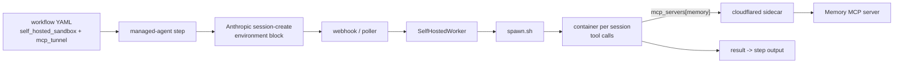
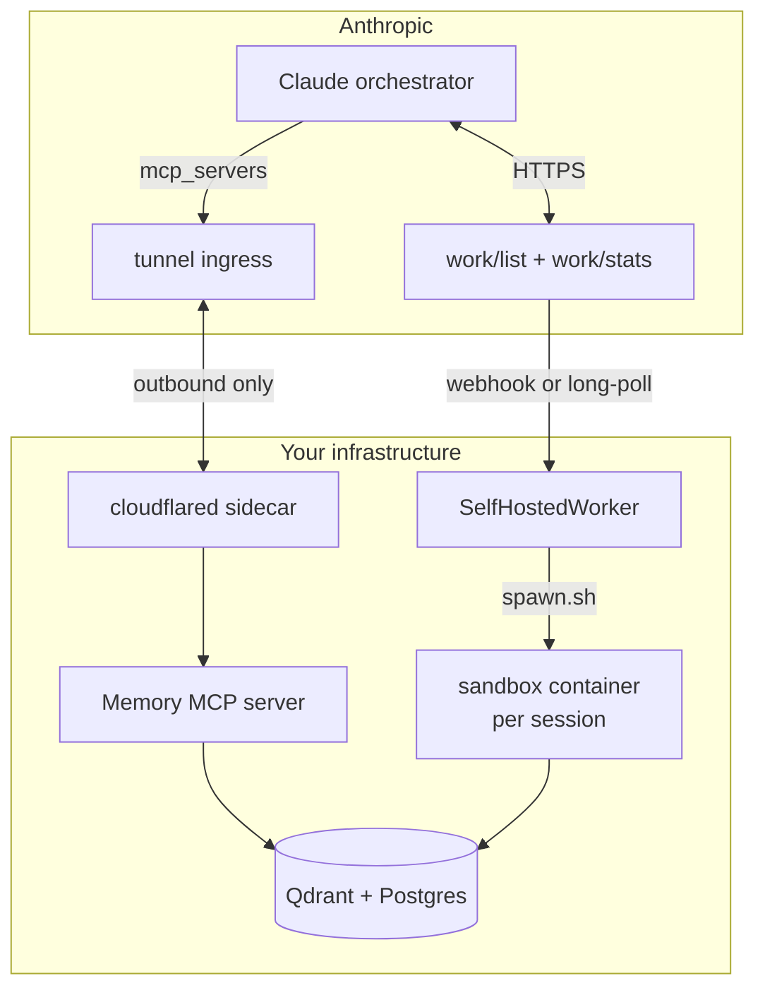

# Anthropic Managed Agents - May 19 2026 Integration

You shipped the agent. The auditor wants the paperwork. The compliance
team wants the data inside the border. The platform team wants the bill
to stop growing. The product team wants to keep moving. Anthropic's
2026-05-19 Managed Agents update is the first release where you don't
have to pick.

Self-hosted sandboxes move tool execution to your infrastructure while
the orchestration brain stays at Anthropic. MCP tunnels reach the
private services your agents need without poking a single inbound hole.
Sandcastle wires the two together with the Memory MCP server pattern
that closes the only material feature gap Anthropic ships with.

Launch reference: <https://www.anthropic.com/news/managed-agents-self-hosted>

## What shipped, in three PRs

This integration arrived in three layered pull requests against
`feat/managed-agents-max`:

1. **PR #226 - typed config.** Introduced `SelfHostedSandboxConfig`,
   `MCPTunnelConfig`, `MCPTunnelServer`, and the six validation helpers
   in `src/sandcastle/engine/`. Schema-only, no runtime side effects.
2. **PR #227 - Phase 1+2 runtime + cookbooks.** The
   `SelfHostedWorker` claim loop, the `spawn.sh` lifecycle script, the
   five provider cookbooks under `deploy/cookbooks/`, the Helm chart
   under `deploy/mcp-tunnel/memory-mcp/`, and the Memory MCP server.
3. **PR #228 - Phase 3 templates + docs (this PR).** The
   `managed_agent_research.yaml` template wiring, the three docs you are
   reading right now, and the EU AI Act page paragraph linking the
   compliance story to the implementation.

## Data flow

The split:

- **Brain stays at Anthropic.** Planning, tool routing, conversation
  state, model inference.
- **Body stays with you.** Tool execution, file I/O, browser, Memory
  storage, every byte of intermediate exhaust.

## Component map

## Files in this integration

Code:

- `src/sandcastle/engine/self_hosted_sandbox.py` - typed config + validators.
- `src/sandcastle/engine/self_hosted_worker.py` - claim loop, spawn coordination.
- `src/sandcastle/engine/mcp_tunnel.py` - tunnel config, messages-API helpers.
- `src/sandcastle/engine/mcp_tunnel_wif.py` - workload-identity-federation helpers.
- `src/sandcastle/engine/memory_mcp_server.py` - Memory MCP server wrapping mem0 + Qdrant.
- `src/sandcastle/api/environments_admin.py` - `work/stats` proxy + SSE stream.

Deploy:

- `deploy/cookbooks/cloudflare/` - Workers + Containers reference.
- `deploy/cookbooks/cf-worker/` - Worker-only (no Container) variant.
- `deploy/cookbooks/daytona/` - Daytona sandboxes (GPU shapes).
- `deploy/cookbooks/modal/` - Modal sandboxes.
- `deploy/cookbooks/vercel/` - Vercel Sandbox.
- `deploy/cookbooks/docker/` - reference local-dev path.
- `deploy/mcp-tunnel/memory-mcp/` - Helm chart for Memory MCP + cloudflared sidecar.

Templates:

- `src/sandcastle/templates/managed_agent_research.yaml` - end-to-end
  worked example combining self_hosted_sandbox + mcp_tunnel + Memory MCP.

Docs:

- [managed-agents-self-hosted.md](./managed-agents-self-hosted.md) -
  the self-hosted sandbox deployment guide.
- [managed-agents-mcp-tunnels.md](./managed-agents-mcp-tunnels.md) -
  the MCP tunnel deployment and security guide.
- [memory-mcp-server.md](./memory-mcp-server.md) - the Memory MCP server
  that closes the `memory_stores` gap.

## Read this in order

If you're an enterprise architect or DevOps engineer landing in
Sandcastle docs for the first time and you want to deploy this update:

1. Skim this page so the boundary picture is in your head.
2. Read [managed-agents-self-hosted.md](./managed-agents-self-hosted.md)
   front to back. Pick a provider, ship a worker, smoke test.
3. Read [managed-agents-mcp-tunnels.md](./managed-agents-mcp-tunnels.md).
   Decide WIF vs manual. Apply for the gated preview if you haven't:
   <https://claude.com/form/claude-managed-agents>.
4. Read [memory-mcp-server.md](./memory-mcp-server.md). Deploy the
   Helm chart from `deploy/mcp-tunnel/memory-mcp/`.
5. Migrate one workflow using the 6-step checklist at the bottom of
   the self-hosted guide. Watch the dashboard `WorkQueuePanel`.
   Cut over.

## External references

- Managed Agents launch post: <https://www.anthropic.com/news/managed-agents-self-hosted>
- Self-hosted sandboxes spec: <https://platform.claude.com/docs/en/managed-agents/self-hosted-sandboxes>
- MCP tunnels spec: <https://platform.claude.com/docs/en/managed-agents/mcp-tunnels>
- Sessions API: <https://platform.claude.com/docs/en/api/managed-agents-sessions>
- `work/stats` API: <https://platform.claude.com/docs/en/api/managed-agents-work-stats>
- MCP spec: <https://modelcontextprotocol.io/specification>
- Gated preview signup: <https://claude.com/form/claude-managed-agents>
- Anthropic subprocessor list: <https://www.anthropic.com/legal/subprocessors>
